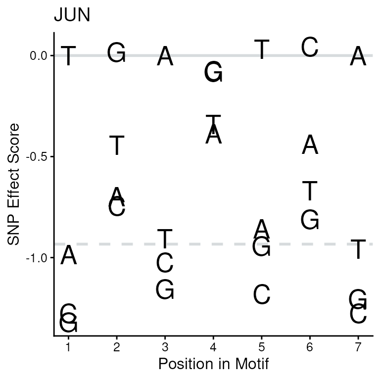
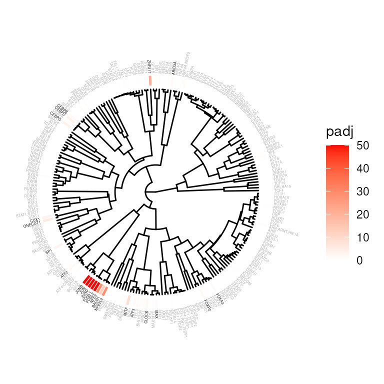
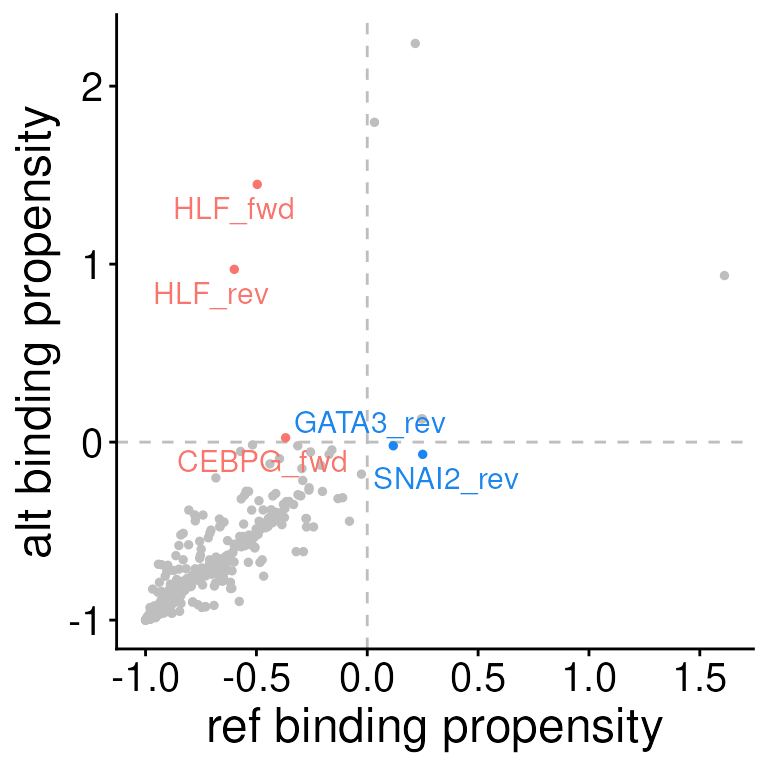
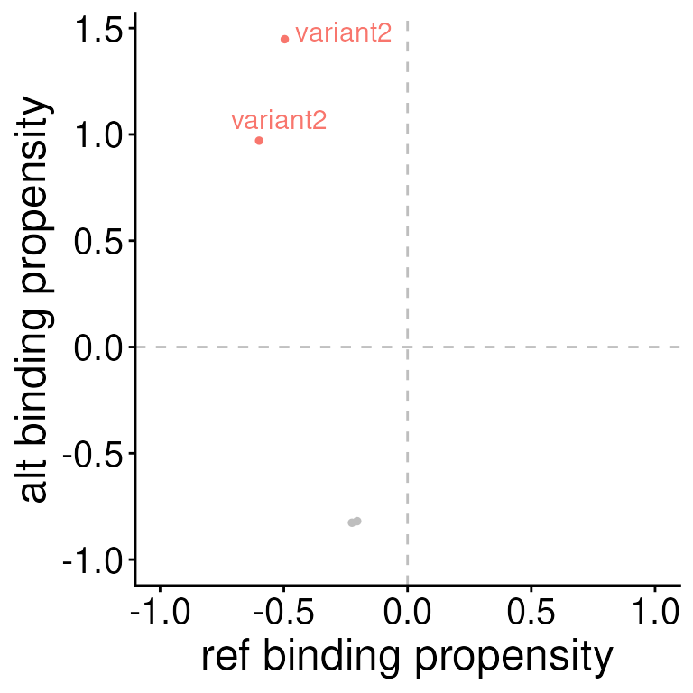

# SEMPLR Vignette

``` r

library(VariantAnnotation)
library(GenomicRanges)
library(BSgenome.Hsapiens.UCSC.hg19)
library(SEMPLR)
```

## SNP Effect Matrices

SEMPLR uses SNP Effect Matrices (SEMs) to score potential motifs. These
are matrices contain binding affinity scores and have rows equal to the
length of the motif and a column for each nucleotide. SEMs are produced
by SEMpl, but a default set of 223 are included with this package in the
`SEMC` data object. A full list of the transcription factors included in
this default set can be found
[here](https://grkenney.github.io/SEMPLR/articles/github.com/grkenney/SEMPLR/blob/main/vignettes/sempl_metadata.csv)
or by running `semData(SEMC)`.

SEMs are stored inside a `SNPEffectMatrix` object and sets of SEMs are
stored in a `SNPEffectMatrixCollection`. The default collection can be
loaded with:

``` r

SEMC
#> An object of class SNPEffectMatrixCollection
#> SEMs(223): TFAP2B, ARNT ... ZNF18, ZSCAN4
#> semData(12): transcription_factor, ensembl_id ... dnase_ENCODE_accession, PWM_source
```

Printing the `SNPEffectMatrixCollection`, we can see that this object
has 2 slots. The first holds the `SNPEffectMatrix` objects with the
matrices and baseline information for each motif. The second slots holds
meta data for each SEM. This object contains 223 SEMs and 12 meta data
features for each.

``` r

SEMC
#> An object of class SNPEffectMatrixCollection
#> SEMs(223): TFAP2B, ARNT ... ZNF18, ZSCAN4
#> semData(12): transcription_factor, ensembl_id ... dnase_ENCODE_accession, PWM_source
```

We can view the SEM meta data slot with the `semData` function.

``` r

semData(SEMC)
#> Key: <transcription_factor>
#>      transcription_factor                                      ensembl_id
#>                    <char>                                          <char>
#>   1:                  AHR                                 ENSG00000106546
#>   2:       AHR:ARNT:HIF1A ENSG00000106546;ENSG00000143437;ENSG00000100644
#>   3:               ARID3A                                 ENSG00000116017
#>   4:                 ARNT                                 ENSG00000143437
#>   5:                ARNTL                                 ENSG00000133794
#>  ---                                                                     
#> 219:                  ZFX                                 ENSG00000005889
#> 220:                ZNF18                                 ENSG00000154957
#> 221:               ZNF217                                 ENSG00000171940
#> 222:               ZNF281                                 ENSG00000162702
#> 223:               ZSCAN4                                 ENSG00000180532
#>      ebi_complex_ac           uniprot_ac                PWM_id
#>              <char>               <char>                <char>
#>   1:                              P35869                M00778
#>   2:                P35869;P27540;Q16665                M00976
#>   3:                              Q99856              MA0151.1
#>   4:                              P27540  ARNT_HUMAN.H11MO.0.B
#>   5:                              O00327 BMAL1_HUMAN.H11MO.0.A
#>  ---                                                          
#> 219:                              P17010   ZFX_HUMAN.H11MO.0.A
#> 220:                              P17022 ZNF18_HUMAN.H11MO.0.C
#> 221:                              O75362                M01306
#> 222:                              Q9Y2X9 ZN281_HUMAN.H11MO.0.A
#> 223:                              Q8NAM6  Zscan4_pwm_secondary
#>                         SEM SEM_baseline cell_type neg_log10_pval
#>                      <char>        <num>    <char>          <num>
#>   1:             M00778.sem   -0.6717610     HepG2      18.350950
#>   2:             M00976.sem   -0.5938010     HepG2      14.290190
#>   3:           MA0151.1.sem   -0.4020880     HepG2       2.980258
#>   4: ARNT_HUMAN.GM12878.sem   -1.8632604   GM12878      12.081160
#>   5:  BMAL1_HUMAN.HepG2.sem   -1.5977194     HepG2      20.220840
#>  ---                                                             
#> 219:    ZFX_HUMAN.HepG2.sem   -0.2478717     HepG2       3.443155
#> 220: ZNF18_HUMAN.HEK293.sem   -1.6459529    HEK293       3.793244
#> 221:             M01306.sem   -0.4596240   GM12878       2.843803
#> 222:  ZN281_HUMAN.HepG2.sem   -0.3926150     HepG2       3.428189
#> 223:   ZSCAN4_secondary.sem   -2.9110180    HEK293      11.973690
#>      chip_ENCODE_accession dnase_ENCODE_accession  PWM_source
#>                     <char>                 <char>      <char>
#>   1:           ENCFF242PUG            ENCFF001UVU    TRANSFAC
#>   2:           ENCFF242PUG            ENCFF001UVU    TRANSFAC
#>   3:           ENCFF460WFF            ENCFF001UVU      JASPAR
#>   4:           ENCFF538DNI            ENCFF759OLD HOCOMOCOv11
#>   5:           ENCFF363NHH            ENCFF897NME HOCOMOCOv11
#>  ---                                                         
#> 219:           ENCFF329DCV            ENCFF897NME HOCOMOCOv11
#> 220:           ENCFF888BHA            ENCFF285OXK HOCOMOCOv11
#> 221:           ENCFF807UJN            ENCFF097LEF    TRANSFAC
#> 222:           ENCFF948PYK            ENCFF897NME HOCOMOCOv11
#> 223:           ENCFF485WHZ            ENCFF910QHN    UNIPROBE
```

We can access all SEMs in the collection the with the function
[`getSEMs()`](https://grkenney.github.io/SEMPLR/reference/getSEMs.md) or
some subset of motifs by specifying a vector of semIds in the `semId`
parameter. All semIds can be viewed in the `transctiption_factor` column
of the meta data. The resulting `SNPEffectMatrix` object contains the
semId, the baseline value used for normalization, and the SEM that
SEMPLR will use to score binding affinity.

``` r

getSEMs(SEMC, semId = "JUN")
#> An object of class SNPEffectMatrix
#> semId:  JUN
#> baseline:  -0.933424
#> sem:
#>            A          C          G          T
#>        <num>      <num>      <num>      <num>
#> 1: -0.985316 -1.2757100 -1.3195100  0.0000000
#> 2: -0.697860 -0.7446700  0.0162566 -0.4440620
#> 3:  0.000000 -1.0239300 -1.1553300 -0.9076800
#> 4: -0.386240 -0.0771875 -0.0818006 -0.3410950
#> 5: -0.857635 -1.1799200 -0.9421760  0.0310366
#> 6: -0.437828  0.0445882 -0.8110000 -0.6691400
#> 7:  0.000000 -1.2758200 -1.2047200 -0.9583980
```

## Scoring Binding

### Prepare Inputs

To calculate binding affinity for a given loci in the genome, we first
make a `GRanges` object for that location. In this example, we will
score a location on chromosome 12 of the human genome.

``` r

# create a GRanges object
gr <- GenomicRanges::GRanges(
    seqnames = "chr12",
    ranges = 94136009
)
```

### Scoring

This `GRanges` object is passed to the
[`scoreBinding()`](https://grkenney.github.io/SEMPLR/reference/scoreBinding.md)
function along with the collection of SEMs and a BSgenome object.

Optionally, a `nFlank` parameter can be specified to dictate the number
of nucleotides to flank each side of the sequence for the supplied
position. By default, the number of nucleotides added will be the
minimum number necessary to score the longest SEM.

A `seqId` parameter may also be used to specify a meta data column in
the `GRanges` object to use as a unique identifier. Otherwise, a unique
identifier will be created from positional information.

The resulting data object is a `SEMScores` object that stores
information about the scored range and its associated sequence, the SEM
meta data, and scoring information.

Please see the (Scoring method)\[#scoring-method\] section below for
details on how sequences are scored with SEMs.

``` r

# calculate binding propensity
sb <- scoreBinding(x = gr, sem = SEMC, genome = Hsapiens)
sb
#> An object of class SEMScores
#> ranges(1): chr12:94136009
#> semData(12): transcription_factor, ensembl_id ... dnase_ENCODE_accession, PWM_source
#> scores(446):
#>               seqId    SEM     rc      score  scoreNorm index              seq
#>              <char> <char> <char>      <num>      <num> <int>           <char>
#>   1: chr12:94136009 TFAP2B    fwd  -1.689754 -0.3068238    15       GCTTTGAGGC
#>   2: chr12:94136009   ARNT    fwd  -6.892799 -0.9693833    17        TTTGAGGCA
#>   3: chr12:94136009   ATF1    fwd  -7.079925 -0.9420095    16      CTTTGAGGCAT
#>   4: chr12:94136009   ATF2    fwd  -4.890126 -0.9098440    16      CTTTGAGGCAT
#>   5: chr12:94136009   ATF3    fwd  -8.605675 -0.9885365    14      GGCTTTGAGGC
#>  ---                                                                          
#> 442: chr12:94136009 ZBTB7A    rev  -1.967170 -0.6612178    18        TTGAGGCAT
#> 443: chr12:94136009    ZFX    rev  -1.162039 -0.4693499    19       TGAGGCATCT
#> 444: chr12:94136009 ZNF281    rev  -5.713722 -0.9749858    14  GGCTTTGAGGCATCT
#> 445: chr12:94136009  ZNF18    rev  -6.739405 -0.9707101    14     GGCTTTGAGGCA
#> 446: chr12:94136009 ZSCAN4    rev -14.469707 -0.9996685    15 GCTTTGAGGCATCTGC
```

We can access this scores table with the
[`scores()`](https://grkenney.github.io/SEMPLR/reference/scores.md)
function and see that we have a row for each variant and SEM
combination. The scoring results has 6 columns:

- **varId**: unique id of the variant as defined in the `id` column of
  the input `GRanges` or `VRanges` object. If not defined, in the
  `seqId` parameter of the `scoreBinding` function, a custom unique
  identifier is generated in the format \[seqname\]:\[range\]

- **semId**: the unique identifier of the SEM

- **score**: the raw (unnormalized) binding affinity score for the
  reference and alternative alleles respectively

- **scoreNorm** : the normalized binding affinity score for the
  reference and alternative alleles respectively. More positive scores
  predict TF binding and more ngative scores predict no TF binding.

- **index**: The position of the optimally scored sequence in the scored
  sequence.

- **seq**: the optimally scored sequence for the reference and
  alternative alleles respectively

``` r

scores(sb)
#>               seqId    SEM     rc      score  scoreNorm index              seq
#>              <char> <char> <char>      <num>      <num> <int>           <char>
#>   1: chr12:94136009 TFAP2B    fwd  -1.689754 -0.3068238    15       GCTTTGAGGC
#>   2: chr12:94136009   ARNT    fwd  -6.892799 -0.9693833    17        TTTGAGGCA
#>   3: chr12:94136009   ATF1    fwd  -7.079925 -0.9420095    16      CTTTGAGGCAT
#>   4: chr12:94136009   ATF2    fwd  -4.890126 -0.9098440    16      CTTTGAGGCAT
#>   5: chr12:94136009   ATF3    fwd  -8.605675 -0.9885365    14      GGCTTTGAGGC
#>  ---                                                                          
#> 442: chr12:94136009 ZBTB7A    rev  -1.967170 -0.6612178    18        TTGAGGCAT
#> 443: chr12:94136009    ZFX    rev  -1.162039 -0.4693499    19       TGAGGCATCT
#> 444: chr12:94136009 ZNF281    rev  -5.713722 -0.9749858    14  GGCTTTGAGGCATCT
#> 445: chr12:94136009  ZNF18    rev  -6.739405 -0.9707101    14     GGCTTTGAGGCA
#> 446: chr12:94136009 ZSCAN4    rev -14.469707 -0.9996685    15 GCTTTGAGGCATCTGC
```

We can subset these scores to just see results for the JUN motif and we
see that the normalized score, in the scoreNorm column, is negative.

We can visualize this sequence on the SEM score for each nucleotide
position and see which nucleotides are contributing to this negative
score.

``` r

# subset JUN score
jun_score <- scores(sb)[SEM == "JUN"]
jun_score
#>             seqId    SEM     rc      score   scoreNorm index     seq
#>            <char> <char> <char>      <num>       <num> <int>  <char>
#> 1: chr12:94136009    JUN    fwd -0.9631318 -0.02038131    19 TGAGGCA
#> 2: chr12:94136009    JUN    rev -1.0092361 -0.05119212    19 TGAGGCA

# plot the JUN motif with the scored sequence
plotSEM(SEMC,
    motif = "JUN",
    motifSeq = jun_score$sequence
)
```



## Enrichment

When scoring large sets of loci, you can also use SEMPLR to predict if
some transcription factors are enriched for binding, bound more than
expected, within the loci of interest.

Here, we will demonstrate this analysis with simulated data. We will
generate and score a set of 1000 sequences. 200 of which will be
generated using the JUN SEM to generate likely binding sequences. The
remaining 800 sequences will be completely random.

We also include assistance in conducting this analysis on gene
promoters. See the (Enrichment in Promoters)\[#enrichment-in-promoters\]
section for more information.

### Prepare Inputs

Expand the section below to see the code used to generate these
sequences.

See code used to generate simulated sequences

``` r

# create random sequences weighted by ppm probabilities
simulatePPMSeqs <- function(ppm, nSeqs) {
    ppm_t <- t(ppm)
    position_samples <- lapply(
        seq_len(nrow(ppm_t)),
        function(i) {
            sample(colnames(ppm_t),
                size = nSeqs,
                replace = TRUE,
                prob = ppm_t[i, ]
            )
        }
    )

    rand_pwm_seq_mtx <- position_samples |>
        unlist() |>
        matrix(ncol = nrow(ppm_t), nrow = nSeqs)
    rand_pwm_seqs <- apply(
        rand_pwm_seq_mtx, 1,
        function(x) paste0(x, collapse = "")
    )

    return(rand_pwm_seqs)
}


# generate DNA sequences
simulateRandSeqs <- function(seqLength, nSeqs = 1) {
    bps <- c("A", "C", "G", "T")
    seqs <- sample(bps,
        replace = TRUE,
        size = seqLength
    ) |>
        stringi::stri_c(collapse = "") |>
        replicate(n = nSeqs)
    return(seqs)
}
```

``` r

ppm <- convertSEMsToPPMs(getSEMs(SEMC, "JUN"))[[1]]

# simulate sequences from the JUN PPM
sim_seqs <- simulatePPMSeqs(ppm = ppm, nSeqs = 200)
# add flanks to the simulated sequences to make them 3x the length of the motif
sim_seqs <- lapply(
    sim_seqs,
    function(x) {
        paste0(
            simulateRandSeqs(seqLength = ncol(ppm)), x,
            simulateRandSeqs(seqLength = ncol(ppm))
        )
    }
) |>
    unlist()

# generate random DNA sequences
rand_seqs <- simulateRandSeqs(seqLength = ncol(ppm) * 3, nSeqs = 800)
```

### Scoring

We have two vectors of sequences, `sim_seqs` and `rand_seqs`. They
contain 200 and 800 sequences respectively. All sequences are 21
nucleotides in length.

We will combine all sequences into a single vector and pass this vector
of sequences to `scoreBinding`. Because we did not pass positional/range
information, this function will now only return the scoring table.

``` r

# combine all sequences into a single vector
all_seqs <- c(sim_seqs, rand_seqs)

sb <- scoreBinding(
    x = all_seqs,
    sem = SEMC, genome = BSgenome.Hsapiens.UCSC.hg19::Hsapiens
)
sb
#>          seqId    SEM     rc      score  scoreNorm index              seq
#>         <char> <char> <char>      <num>      <num> <int>           <char>
#>      1:      1 TFAP2B    fwd  -2.160351 -0.4997585     5       GCATGAGACA
#>      2:      2 TFAP2B    fwd  -2.973604 -0.7153140    12       TCATGAGACC
#>      3:      3 TFAP2B    fwd  -3.292712 -0.7718055     9       GACTAATGAT
#>      4:      4 TFAP2B    fwd  -3.402059 -0.7884620     9       GATTAACGCT
#>      5:      5 TFAP2B    fwd  -3.564211 -0.8109504     5       GCATGAATAA
#>     ---                                                                  
#> 445996:    996 ZSCAN4    rev -15.790916 -0.9998673     1 GGAAGTCAACAAGTCC
#> 445997:    997 ZSCAN4    rev -15.511596 -0.9998390     1 ATGGAAGACTGCAAAC
#> 445998:    998 ZSCAN4    rev -15.341916 -0.9998189     2 CGATTTGCGAAGGGCT
#> 445999:    999 ZSCAN4    rev -14.792960 -0.9997350     1 CTGTAGATCTCAGCAC
#> 446000:   1000 ZSCAN4    rev -16.862318 -0.9999369     5 CAGATCGGTTAGATGC
```

### Test for Enrichment

The results of `scoreBinding` can be passed directly to the `enrichSEMs`
function along with our collection of SEMs, and the sequences we scored.

Optionally, we can provide a background set of sequences or ranges for
this analysis. If none is provided, `enrichSEMs` will scramble the
scored sequences provided to use as a background.

`enrichSEMs` performs a binomal test to determine if any of the
transcription factors scored are bound more than expected by chance.

``` r

e <- enrichSEMs(sb, sem = SEMC, seqs = all_seqs)
#> Building background set (this may take several minutes) ...

# order the results by adjusted pvalue
head(e[order(padj, decreasing = FALSE)])
#>       SEM        pvalue          padj n_bound n_bound_bg
#>    <char>         <num>         <num>   <int>      <int>
#> 1:    JUN 7.631583e-201 1.701843e-198     318         32
#> 2:  FOSL1 2.342732e-139 2.612146e-137     134          4
#> 3:   JUND  4.070893e-92  3.026030e-90      86          2
#> 4:   JUNB  1.432315e-74  7.985158e-73      55          0
#> 5:  FOSL2  4.037096e-54  1.800545e-52      43          0
#> 6:   NFE2  4.098514e-32  1.523281e-30      41          2
```

The resulting columns contain the p-value from the binomal test, the
Benjamini & Hochberg ajusted p-value, and the number of sequences where
each TF was predicted to be bound in the foreground set (n_bound) and
the background set (n_bound_bg).

### Visualization

While JUN was the top significant SEM of our enrichment analysis, there
are also several other significant SEMs. Because some motif sequences
can be very similar, this is not unexpected.

SEMPLR’s `plotEnrich` function takes this motif relatedness into account
when visualizing these enrichment results. SEMs are clustered by
similarity and plotted on a dendrogram so similar motifs are plotted
near eachother.

The heatmap plots the -log10 adjusted pvalue of the binomial test (
-log10(padj) ) and the TFs are colored according to an adjusted pvalue
threshold.

``` r

plotEnrich(e,
    sem = SEMC,
    threshold = 0.05, method = "WPCC",
    pvalRange = c(0, 50)
)
#> ! # Invaild edge matrix for <phylo>. A <tbl_df> is returned.
#> ! # Invaild edge matrix for <phylo>. A <tbl_df> is returned.
#> ! # Invaild edge matrix for <phylo>. A <tbl_df> is returned.
#> ! # Invaild edge matrix for <phylo>. A <tbl_df> is returned.
#> ℹ invalid tbl_tree object. Missing column: label.
#> ℹ invalid tbl_tree object. Missing column: label.
#> ! # Invaild edge matrix for <phylo>. A <tbl_df> is returned.
#> ! # Invaild edge matrix for <phylo>. A <tbl_df> is returned.
#> Scale for y is already present.
#> Adding another scale for y, which will replace the existing scale.
#> Scale for fill is already present.
#> Adding another scale for fill, which will replace the existing scale.
```



### Enrichment in Promoters

One potential application of `enrichSEMs` is predicting TF(s)
responsible for observed differential gene expression between two
biological conditions. Given gene sets of interest (e.g. upregulated
genes) and a background set (e.g. all expressed genes), we could try to
predict there are TFs enriched for binding the promoters of the genes of
interest; providing supporting evidence for a mechanism where the
differential expression is driven by differences in TF activity.

The getCoordinates function extracts promoter sequences and tests for
predicted binding site enrichment in foreground sets using
enrichmentSets. Significant enrichment of TF binding in the promoters of
upregulated genes can provide mechanistic insight into gene expression
changes.

To aid in this analysis, we have provided a helper function,
`enrichmentSets`, to pull genomic ranges of gene promoter and,
optionally, background sets given gene or transcript ids. Below is a
minimal example to illustrate this function. In practice, gene ids of
interest could be supplied to `enrichmentSets` to generate GRanges
objects that can be directly supplied to `enrichSEMs`.

``` r

library(TxDb.Hsapiens.UCSC.hg38.knownGene)
#> Loading required package: GenomicFeatures
#> Loading required package: AnnotationDbi
library(BSgenome.Hsapiens.UCSC.hg38)
#> Loading required package: GenomeInfoDb
#> 
#> Attaching package: 'BSgenome.Hsapiens.UCSC.hg38'
#> The following object is masked from 'package:BSgenome.Hsapiens.UCSC.hg19':
#> 
#>     Hsapiens
library(org.Hs.eg.db)
#> 

txdb <- TxDb.Hsapiens.UCSC.hg38.knownGene
orgdb <- org.Hs.eg.db

genes_oi <- c("ENSG00000139618", "ENSG00000157764")
background_genes <- c("ENSG00000111640", "ENSG00000075624", "ENSG00000165704")

result <- enrichmentSets(
    foreground_ids = genes_oi,
    background_ids = background_genes,
    txdb = txdb,
    orgdb = orgdb,
    id_type = "ENSEMBL"
)
#> Mapping foreground ids to ENTREZIDs...
#> 'select()' returned 1:1 mapping between keys and columns
#> Successfully mapped 100% of the provided foreground ids.
#> Mapping background ids to ENTREZIDs...
#> 'select()' returned 1:1 mapping between keys and columns
#> 
#> Successfully mapped 100% of the provided foreground ids.
#> Checking for inflation...
#> 'select()' returned 1:1 mapping between keys and columns
#> 
#> Combining overlapping promoter ranges within genes. (This step may take 1-2 minutes)...
#> Defining background elements...
result
#> $backgroundElements
#> GRanges object with 2 ranges and 3 metadata columns:
#>        seqnames          ranges strand |         ENSEMBL    ENTREZID
#>           <Rle>       <IRanges>  <Rle> |     <character> <character>
#>   2597    chr12 6534212-6534561      + | ENSG00000111640        2597
#>     60     chr7 5563853-5564202      - | ENSG00000075624          60
#>              GENETYPE
#>           <character>
#>   2597 protein-coding
#>     60 protein-coding
#>   -------
#>   seqinfo: 711 sequences (1 circular) from hg38 genome
#> 
#> $foregroundElements
#> GRanges object with 2 ranges and 3 metadata columns:
#>       seqnames              ranges strand |         ENSEMBL    ENTREZID
#>          <Rle>           <IRanges>  <Rle> |     <character> <character>
#>   675    chr13   32314786-32315135      + | ENSG00000139618         675
#>   673     chr7 140924880-140925229      - | ENSG00000157764         673
#>             GENETYPE
#>          <character>
#>   675 protein-coding
#>   673 protein-coding
#>   -------
#>   seqinfo: 711 sequences (1 circular) from hg38 genome
#> 
#> $backgroundUniverse
#> GRanges object with 3 ranges and 3 metadata columns:
#>        seqnames              ranges strand |         ENSEMBL    ENTREZID
#>           <Rle>           <IRanges>  <Rle> |     <character> <character>
#>   2597    chr12     6534212-6534561      + | ENSG00000111640        2597
#>     60     chr7     5563853-5564202      - | ENSG00000075624          60
#>   3251     chrX 134459865-134460214      + | ENSG00000165704        3251
#>              GENETYPE
#>           <character>
#>   2597 protein-coding
#>     60 protein-coding
#>   3251 protein-coding
#>   -------
#>   seqinfo: 711 sequences (1 circular) from hg38 genome
```

The result of `enrichmentSets` is a named list of 3 GRanges objects. The
“foregroundElements” entry includes the promoter ranges for all genes
that were sucessfully identified in the genome. The “backgroundElements”
entry is a randomly selected set of promoter regions from the background
set provided. The “backgroundUniverse” entry represents all of the
background elements that were sucessfully mapped and sampled from. If a
background set is not provided to `enrichmentSets`, one will be randomly
selected from the promoters in the genome not included in the gene set
of interest.

To calculate enrichment for these promoters, we would first score the
foreground ranges with `scoreBinding`. Then we can provide the
foreground scores and just the background ranges to `enrichSEMs`. While
the example above is trivial, the enrichment steps would look like this:

    sb <- scoreBinding(
        x = result$foregroundElements,
        sem = SEMC, genome = BSgenome.Hsapiens.UCSC.hg38::Hsapiens
    )
    e <- enrichSEMs(sb, sem = SEMC, background = result$backgroundElements,
                    genome = BSgenome.Hsapiens.UCSC.hg38::Hsapiens)

## Scoring Variants

SEMPLR also provides functionality for scoring variants, comparing TF
binding between alleles, and helping identify TFs whose binding is
gained or lost with genetic variation.

### Prepare Inputs

First, we will define the variants we want to score. Variants can be
supplied to SEMPLR as either a `VRanges` or a `GRanges` object. If using
`VRanges` alleles must be stored in the `ref` and `alt` parameters. If
using `GRanges` the alleles should be stored in seperate metadata
columns.

Insertions and deletions should be specified by an empty character
vector in the appropriate allele.

Optionally, an `id` column can be defined in the object metadata to be
used as a unique identifier for each variant.

``` r

vr <- VRanges(
    seqnames = c("chr12", "chr19"),
    ranges = c(94136009, 10640062),
    ref = c("G", "T"), alt = c("C", "A"),
    id = c("variant1", "variant2")
)
```

### Scoring

The `scoreVariants` function scores each allele of each variant against
every SEM provided. From the resulting data object, we can see that we
scored 2 variants, the SEM meta data stored in the object has 13 fields,
and we have 446 rows in the `scores` results table.

There is a row in the `scores` table for each variant/SEM combination.
Here we scored 2 variants x 223 SEMs to get 446 rows.

``` r

sempl_results <- scoreVariants(
    x = vr,
    sem = SEMC,
    genome = BSgenome.Hsapiens.UCSC.hg38::Hsapiens,
    varId = "id"
)
#> Warning: Allele 'G' or 'C' does not match reference sequence 'T' in
#> chr12:94136009

sempl_results
#> An object of class SEMScores
#> ranges(2): variant1, variant2
#> semData(12): transcription_factor, ensembl_id ... dnase_ENCODE_accession, PWM_source
#> scores(892):
#>         varId            SEM     rc           refSeq           altSeq
#>        <char>         <char> <char>           <char>           <char>
#>   1: variant1            AHR    fwd      GTTGTTTAACA      TGTTCTTTAAC
#>   2: variant1            AHR    rev      TGTTTAACAAT      TCTTTAACAAT
#>   3: variant1 AHR:ARNT:HIF1A    fwd        TGTTTAACA        TTCTTTAAC
#>   4: variant1 AHR:ARNT:HIF1A    rev        TGTTTAACA        TCTTTAACA
#>   5: variant1         ARID3A    fwd           GTTTAA           TTCTTT
#>  ---                                                                 
#> 888: variant2         ZNF217    rev         AAATTATT         AAATTATA
#> 889: variant2         ZNF281    fwd  CTTGGGCAAATTATT  CTTGGGCAAATTATA
#> 890: variant2         ZNF281    rev  ATTTAATCCTCTAAG  TATAATCCTCTAAGG
#> 891: variant2         ZSCAN4    fwd TCTTGGGCAAATTATT TTATATAATCCTCTAA
#> 892: variant2         ZSCAN4    rev TCTTGGGCAAATTATT AATTATATAATCCTCT
#>         refScore    altScore    refNorm    altNorm refVarIndex altVarIndex
#>            <num>       <num>      <num>      <num>       <int>       <int>
#>   1:  -1.2300844  -1.6478822 -0.3209091 -0.4916554          17          16
#>   2:  -1.3978009  -1.5703596 -0.3954389 -0.4635925          19          19
#>   3:  -1.3623427  -1.3507801 -0.4129895 -0.4082659          19          18
#>   4:  -1.4767820  -1.6426721 -0.4577541 -0.5166537          19          19
#>   5:  -0.8912875  -0.6537551 -0.2875797 -0.1600747          20          18
#>  ---                                                                      
#> 888:  -0.6294883  -0.9997475 -0.1110737 -0.3122880          13          13
#> 889:  -5.1094131  -5.0619102 -0.9619721 -0.9606991           6           6
#> 890:  -4.7762022  -4.9007654 -0.9520919 -0.9560548          18          19
#> 891: -17.3142490 -17.0180321 -0.9999538 -0.9999433           5          16
#> 892: -16.1095562 -16.7161427 -0.9998936 -0.9999301           5          14
```

Similar to the scoring table produced by `scoreBinding`, `scoreVariants`
produces a table with 10 columns:

- **varId**: unique id of the variant as defined in the `id` column of
  the input `GRanges` or `VRanges` object. If not defined, a custom
  unique identifier is generated in the format
  \[seqname\]:\[range\]:\[ref_allele\]\>\[alt_allele\]

- **semId**: the unique identifier of the SEM

- **refSeq** and **altSeq**: the optimally scored sequence for the
  reference and alternative alleles respectively

- **refScore** and **altScore**: the raw (unnormalized) binding affinity
  score for the reference and alternative alleles respectively

- **refNorm** and **altNorm**: the normalized binding affinity score for
  the reference and alternative alleles respectively. More positive
  scores predict TF binding and more negative scores predict no TF
  binding.

- **refVarIndex** and **altVarIndex**: The position of the frame’s
  starting indeces in the scored sequence

There are accessor functions to isolate each slot of the resulting data
object:

``` r

# access the variants slot
getRanges(sempl_results)

# access the semData slot
semData(sempl_results)

# access the scores slot
scores(sempl_results)
```

### Visualization

SEMPLR provides two visualization functions for `scoreVariants` results.

The first function, `plotSEMMotifs` plots all SEM scores for a given
variant.

Here, we can see that both HLF and CEBPG are predicted to be bound in
the alt allele of variant2, but no the ref allele.

``` r

plotSEMMotifs(
    s = sempl_results,
    variant = "variant2",
    label = "transcription_factor"
)
```



The second function, `plotSEMVariants` plots the scores for all variants
for a given SEM.

Here, we can see that it’s variant2 where the mutation from the ref to
the alt allele creates the potential for a gained TF binding site.

``` r

plotSEMVariants(sempl_results, sem = "HLF")
```



## Extras

### Scoring Method

#### Sequence preparation

Both the `scoreBinding` and `scoreVariants` functions use the same
scoring method. If given genome ranges, as `GRanges` or `VRanges`
objects, sequences for those ranges are acquired from the provided
`BSgenome` object. Flanks are added to either end of this sequence equal
to the `nFlank` parameter provided by the user, otherwise, the length of
the flanks are equal to the longest SEM (number of rows).

#### Scoring

SEMPLR attempts to find the optimal binding location of the associated
transcription factor by scoring every frame that includes at least one
nucleotide of the provided range. If no flanks were added (`nFlank = 0`)
then SEMPLR will find the optimal binding site within the provided
region.

SEMs are log transformed matrices, and therefore can be added per base
at each position to generate a binding affinity score (stored in the
`score` column of the scores table). These scores are normalized to the
baselines produced by the SEMpl commandline tool and the normalized
scores are stored in the `scoreNorm` field. These normalized scores
should be used for further analysis.

The optimal binding site is defined as the site with the highest
normalized score.

In general, more positive scores predict TF binding and negative scores
predict no TF binding.

### Loading a custom set of SEMs

The `SEMC` data object is provided with this package with a default set
of 223 SEMs. While we think this set may be sufficient for many
analyses, SEMPLR also supports generation of new
`SNPEffectMatrixCollection`s should you want to generate a custom set of
SEMs with the SEMpl command line tool.

First, we create a list of file paths to the .sem files we want to
include. We will also load the meta data for each sem in a `data.table`
object. If meta data is used, all SEMs must be represented in the meta
data table.

``` r

# find .sem files
sem_folder <- system.file("extdata", "SEMs", package = "SEMPLR")
sem_files <- list.files(sem_folder, full.names = TRUE)

# load metadata
sempl_metadata_file <- system.file("extdata", "sempl_metadata.csv",
    package = "SEMPLR"
)
sempl_metadata <- read.csv(sempl_metadata_file)
```

We will load the matrix and meta data for all SEMs in a single
`SNPEffectMatrixCollection` object. This object has two slots, one
containing a named list of the matrices and a second slot containing our
meta data table with a key column connecting the meta data to the names
of the matrices.

``` r

ix <- lapply(
    sem_files,
    function(x) which(sempl_metadata$SEM == basename(x))
) |>
    unlist()
sem_ids <- sempl_metadata$transcription_factor[ix]
```

``` r

sc <- loadSEMCollection(
    semFiles = sem_files,
    semMetaData = sempl_metadata,
    semMetaKey = "transcription_factor",
    semIds = sem_ids
)
sc
#> An object of class SNPEffectMatrixCollection
#> SEMs(223): TFAP2B, ARNT ... ZNF18, ZSCAN4
#> semData(12): transcription_factor, ensembl_id ... dnase_ENCODE_accession, PWM_source
```

``` r

devtools::session_info()
#> ─ Session info ───────────────────────────────────────────────────────────────
#>  setting  value
#>  version  R version 4.5.2 (2025-10-31)
#>  os       Ubuntu 24.04.3 LTS
#>  system   x86_64, linux-gnu
#>  ui       X11
#>  language en
#>  collate  en_US.UTF-8
#>  ctype    en_US.UTF-8
#>  tz       UTC
#>  date     2026-02-05
#>  pandoc   3.8.2.1 @ /usr/bin/ (via rmarkdown)
#>  quarto   1.7.32 @ /usr/local/bin/quarto
#> 
#> ─ Packages ───────────────────────────────────────────────────────────────────
#>  package                           * version   date (UTC) lib source
#>  abind                               1.4-8     2024-09-12 [1] RSPM (R 4.5.0)
#>  AnnotationDbi                     * 1.72.0    2025-10-29 [1] Bioconductor 3.22 (R 4.5.2)
#>  ape                                 5.8-1     2024-12-16 [1] RSPM (R 4.5.0)
#>  aplot                               0.2.9     2025-09-12 [1] RSPM (R 4.5.0)
#>  Biobase                           * 2.70.0    2025-10-29 [1] Bioconductor 3.22 (R 4.5.2)
#>  BiocGenerics                      * 0.56.0    2025-10-29 [1] Bioconductor 3.22 (R 4.5.2)
#>  BiocIO                            * 1.20.0    2025-10-29 [1] Bioconductor 3.22 (R 4.5.2)
#>  BiocManager                         1.30.27   2025-11-14 [2] CRAN (R 4.5.2)
#>  BiocParallel                        1.44.0    2025-10-29 [1] Bioconductor 3.22 (R 4.5.2)
#>  BiocStyle                         * 2.38.0    2025-10-29 [1] Bioconductor 3.22 (R 4.5.2)
#>  Biostrings                        * 2.78.0    2025-10-29 [1] Bioconductor 3.22 (R 4.5.2)
#>  bit                                 4.6.0     2025-03-06 [1] RSPM (R 4.5.0)
#>  bit64                               4.6.0-1   2025-01-16 [1] RSPM (R 4.5.0)
#>  bitops                              1.0-9     2024-10-03 [1] RSPM (R 4.5.0)
#>  blob                                1.3.0     2026-01-14 [1] RSPM (R 4.5.0)
#>  bookdown                            0.46      2025-12-05 [1] RSPM (R 4.5.0)
#>  BSgenome                          * 1.78.0    2025-10-29 [1] Bioconductor 3.22 (R 4.5.2)
#>  BSgenome.Hsapiens.UCSC.hg19       * 1.4.3     2025-10-31 [1] Bioconductor
#>  BSgenome.Hsapiens.UCSC.hg38       * 1.4.5     2025-10-31 [1] Bioconductor
#>  bslib                               0.10.0    2026-01-26 [1] RSPM (R 4.5.0)
#>  cachem                              1.1.0     2024-05-16 [2] RSPM (R 4.5.0)
#>  cigarillo                           1.0.0     2025-10-29 [1] Bioconductor 3.22 (R 4.5.2)
#>  cli                                 3.6.5     2025-04-23 [2] RSPM (R 4.5.0)
#>  codetools                           0.2-20    2024-03-31 [3] CRAN (R 4.5.2)
#>  crayon                              1.5.3     2024-06-20 [2] RSPM (R 4.5.0)
#>  curl                                7.0.0     2025-08-19 [2] RSPM (R 4.5.0)
#>  data.table                          1.18.2.1  2026-01-27 [1] RSPM (R 4.5.0)
#>  DBI                                 1.2.3     2024-06-02 [1] RSPM (R 4.5.0)
#>  DelayedArray                        0.36.0    2025-10-29 [1] Bioconductor 3.22 (R 4.5.2)
#>  desc                                1.4.3     2023-12-10 [2] RSPM (R 4.5.0)
#>  devtools                            2.4.6     2025-10-03 [2] RSPM (R 4.5.0)
#>  digest                              0.6.39    2025-11-19 [2] RSPM (R 4.5.0)
#>  dplyr                               1.2.0     2026-02-03 [1] RSPM (R 4.5.0)
#>  ellipsis                            0.3.2     2021-04-29 [2] RSPM (R 4.5.0)
#>  evaluate                            1.0.5     2025-08-27 [2] RSPM (R 4.5.0)
#>  farver                              2.1.2     2024-05-13 [1] RSPM (R 4.5.0)
#>  fastmap                             1.2.0     2024-05-15 [2] RSPM (R 4.5.0)
#>  fontBitstreamVera                   0.1.1     2017-02-01 [1] RSPM (R 4.5.0)
#>  fontLiberation                      0.1.0     2016-10-15 [1] RSPM (R 4.5.0)
#>  fontquiver                          0.2.1     2017-02-01 [1] RSPM (R 4.5.0)
#>  fs                                  1.6.6     2025-04-12 [2] RSPM (R 4.5.0)
#>  gdtools                             0.4.4     2025-10-06 [1] RSPM (R 4.5.0)
#>  generics                          * 0.1.4     2025-05-09 [1] RSPM (R 4.5.0)
#>  GenomeInfoDb                      * 1.46.2    2025-12-04 [1] Bioconductor 3.22 (R 4.5.2)
#>  GenomicAlignments                   1.46.0    2025-10-29 [1] Bioconductor 3.22 (R 4.5.2)
#>  GenomicFeatures                   * 1.62.0    2025-10-29 [1] Bioconductor 3.22 (R 4.5.2)
#>  GenomicRanges                     * 1.62.1    2025-12-08 [1] Bioconductor 3.22 (R 4.5.2)
#>  ggfun                               0.2.0     2025-07-15 [1] RSPM (R 4.5.0)
#>  ggiraph                             0.9.3     2026-01-19 [1] RSPM (R 4.5.0)
#>  ggplot2                             4.0.2     2026-02-03 [1] RSPM (R 4.5.0)
#>  ggplotify                           0.1.3     2025-09-20 [1] RSPM (R 4.5.0)
#>  ggrepel                             0.9.6     2024-09-07 [1] RSPM (R 4.5.0)
#>  ggtree                              4.0.4     2026-01-05 [1] Bioconductor 3.22 (R 4.5.2)
#>  glue                                1.8.0     2024-09-30 [2] RSPM (R 4.5.0)
#>  gridGraphics                        0.5-1     2020-12-13 [1] RSPM (R 4.5.0)
#>  gtable                              0.3.6     2024-10-25 [1] RSPM (R 4.5.0)
#>  htmltools                           0.5.9     2025-12-04 [2] RSPM (R 4.5.0)
#>  htmlwidgets                         1.6.4     2023-12-06 [2] RSPM (R 4.5.0)
#>  httr                                1.4.7     2023-08-15 [1] RSPM (R 4.5.0)
#>  IRanges                           * 2.44.0    2025-10-29 [1] Bioconductor 3.22 (R 4.5.2)
#>  jquerylib                           0.1.4     2021-04-26 [2] RSPM (R 4.5.0)
#>  jsonlite                            2.0.0     2025-03-27 [2] RSPM (R 4.5.0)
#>  KEGGREST                            1.50.0    2025-10-29 [1] Bioconductor 3.22 (R 4.5.2)
#>  knitr                               1.51      2025-12-20 [1] RSPM (R 4.5.0)
#>  labeling                            0.4.3     2023-08-29 [1] RSPM (R 4.5.0)
#>  lattice                             0.22-7    2025-04-02 [3] CRAN (R 4.5.2)
#>  lazyeval                            0.2.2     2019-03-15 [1] RSPM (R 4.5.0)
#>  lifecycle                           1.0.5     2026-01-08 [1] RSPM (R 4.5.0)
#>  magrittr                            2.0.4     2025-09-12 [2] RSPM (R 4.5.0)
#>  MASS                                7.3-65    2025-02-28 [3] CRAN (R 4.5.2)
#>  Matrix                              1.7-4     2025-08-28 [3] CRAN (R 4.5.2)
#>  MatrixGenerics                    * 1.22.0    2025-10-29 [1] Bioconductor 3.22 (R 4.5.2)
#>  matrixStats                       * 1.5.0     2025-01-07 [1] RSPM (R 4.5.0)
#>  memoise                             2.0.1     2021-11-26 [2] RSPM (R 4.5.0)
#>  nlme                                3.1-168   2025-03-31 [3] CRAN (R 4.5.2)
#>  org.Hs.eg.db                      * 3.22.0    2026-02-03 [1] Bioconductor
#>  otel                                0.2.0     2025-08-29 [2] RSPM (R 4.5.0)
#>  patchwork                           1.3.2     2025-08-25 [1] RSPM (R 4.5.0)
#>  pillar                              1.11.1    2025-09-17 [2] RSPM (R 4.5.0)
#>  pkgbuild                            1.4.8     2025-05-26 [2] RSPM (R 4.5.0)
#>  pkgconfig                           2.0.3     2019-09-22 [2] RSPM (R 4.5.0)
#>  pkgdown                             2.2.0     2025-11-06 [2] RSPM (R 4.5.0)
#>  pkgload                             1.5.0     2026-02-03 [2] RSPM (R 4.5.0)
#>  png                                 0.1-8     2022-11-29 [1] RSPM (R 4.5.0)
#>  purrr                               1.2.1     2026-01-09 [1] RSPM (R 4.5.0)
#>  R6                                  2.6.1     2025-02-15 [2] RSPM (R 4.5.0)
#>  ragg                                1.5.0     2025-09-02 [2] RSPM (R 4.5.0)
#>  rappdirs                            0.3.4     2026-01-17 [1] RSPM (R 4.5.0)
#>  RColorBrewer                        1.1-3     2022-04-03 [1] RSPM (R 4.5.0)
#>  Rcpp                                1.1.1     2026-01-10 [1] RSPM (R 4.5.0)
#>  RCurl                               1.98-1.17 2025-03-22 [1] RSPM (R 4.5.0)
#>  remotes                             2.5.0     2024-03-17 [1] RSPM (R 4.5.0)
#>  restfulr                            0.0.16    2025-06-27 [1] RSPM (R 4.5.1)
#>  rjson                               0.2.23    2024-09-16 [1] RSPM (R 4.5.0)
#>  rlang                               1.1.7     2026-01-09 [1] RSPM (R 4.5.0)
#>  rmarkdown                           2.30      2025-09-28 [2] RSPM (R 4.5.0)
#>  Rsamtools                         * 2.26.0    2025-10-29 [1] Bioconductor 3.22 (R 4.5.2)
#>  RSQLite                             2.4.5     2025-11-30 [1] RSPM (R 4.5.0)
#>  rtracklayer                       * 1.70.1    2025-12-22 [1] Bioconductor 3.22 (R 4.5.2)
#>  S4Arrays                            1.10.1    2025-12-01 [1] Bioconductor 3.22 (R 4.5.2)
#>  S4Vectors                         * 0.48.0    2025-10-29 [1] Bioconductor 3.22 (R 4.5.2)
#>  S7                                  0.2.1     2025-11-14 [1] RSPM (R 4.5.0)
#>  sass                                0.4.10    2025-04-11 [2] RSPM (R 4.5.0)
#>  scales                              1.4.0     2025-04-24 [1] RSPM (R 4.5.0)
#>  SEMPLR                            * 0.99.0    2026-02-05 [1] Bioconductor
#>  Seqinfo                           * 1.0.0     2025-10-29 [1] Bioconductor 3.22 (R 4.5.2)
#>  sessioninfo                         1.2.3     2025-02-05 [2] RSPM (R 4.5.0)
#>  SparseArray                         1.10.8    2025-12-18 [1] Bioconductor 3.22 (R 4.5.2)
#>  stringi                             1.8.7     2025-03-27 [2] RSPM (R 4.5.0)
#>  SummarizedExperiment              * 1.40.0    2025-10-29 [1] Bioconductor 3.22 (R 4.5.2)
#>  systemfonts                         1.3.1     2025-10-01 [2] RSPM (R 4.5.0)
#>  textshaping                         1.0.4     2025-10-10 [2] RSPM (R 4.5.0)
#>  tibble                              3.3.1     2026-01-11 [1] RSPM (R 4.5.0)
#>  tidyr                               1.3.2     2025-12-19 [1] RSPM (R 4.5.0)
#>  tidyselect                          1.2.1     2024-03-11 [1] RSPM (R 4.5.0)
#>  tidytree                            0.4.7     2026-01-08 [1] RSPM (R 4.5.0)
#>  treeio                              1.34.0    2025-10-30 [1] Bioconductor 3.22 (R 4.5.2)
#>  TxDb.Hsapiens.UCSC.hg38.knownGene * 3.22.0    2026-02-03 [1] Bioconductor
#>  UCSC.utils                          1.6.1     2025-12-11 [1] Bioconductor 3.22 (R 4.5.2)
#>  universalmotif                      1.28.0    2025-10-30 [1] Bioconductor 3.22 (R 4.5.2)
#>  usethis                             3.2.1     2025-09-06 [2] RSPM (R 4.5.0)
#>  VariantAnnotation                 * 1.56.0    2025-10-29 [1] Bioconductor 3.22 (R 4.5.2)
#>  vctrs                               0.7.1     2026-01-23 [1] RSPM (R 4.5.0)
#>  withr                               3.0.2     2024-10-28 [2] RSPM (R 4.5.0)
#>  xfun                                0.56      2026-01-18 [1] RSPM (R 4.5.0)
#>  XML                                 3.99-0.20 2025-11-08 [1] RSPM (R 4.5.0)
#>  XVector                           * 0.50.0    2025-10-29 [1] Bioconductor 3.22 (R 4.5.2)
#>  yaml                                2.3.12    2025-12-10 [1] RSPM (R 4.5.0)
#>  yulab.utils                         0.2.4     2026-02-02 [1] RSPM (R 4.5.0)
#> 
#>  [1] /__w/_temp/Library
#>  [2] /usr/local/lib/R/site-library
#>  [3] /usr/local/lib/R/library
#>  * ── Packages attached to the search path.
#> 
#> ──────────────────────────────────────────────────────────────────────────────
```
